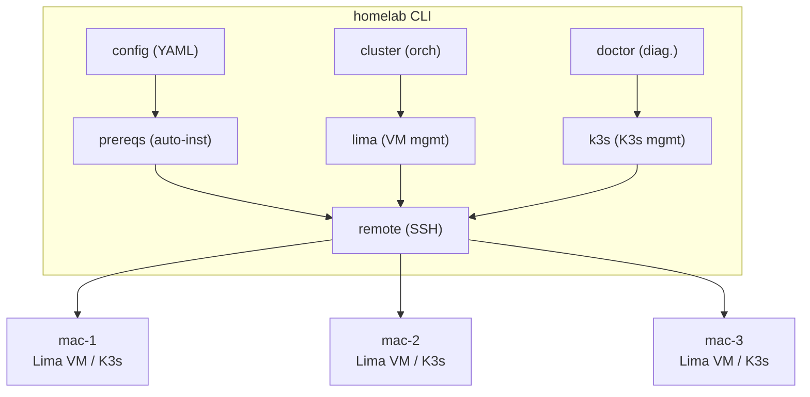

# homelab

Declaratively provision and manage multi-node Kubernetes homelab clusters on macOS using [Lima VZ](https://lima-vm.io/) and [K3s](https://k3s.io/).

## Features

- **Declarative YAML config** — define your entire cluster topology in a single file
- **Multi-node HA** — support for 3+ control plane nodes with embedded etcd
- **Mixed architectures** — ARM64 and AMD64 nodes in the same cluster
- **Parallel provisioning** — all VMs created concurrently for fast setup
- **Idempotent operations** — re-run any command safely without side effects
- **Rolling upgrades** — upgrade K3s across the cluster with zero downtime
- **Backup & restore** — etcd snapshot management for disaster recovery
- **Pre-flight diagnostics** — comprehensive health checks across all nodes
- **Homebrew distribution** — install via `brew install vitruviansoftware/tap/homelab`

## Installation

### Homebrew (recommended)

```bash
brew tap vitruviansoftware/tap
brew install vitruviansoftware/tap/homelab
```

### From source

```bash
git clone https://github.com/VitruvianSoftware/homelab.git
cd homelab
make install
```

### GitHub Releases

Download pre-built binaries from [Releases](https://github.com/VitruvianSoftware/homelab/releases).

## Quick Start

1. **Create a config file** (`homelab.yaml`):

```yaml
cluster:
  name: my-homelab
  k3sVersion: "v1.31.2+k3s1"
  kubeconfig: "~/.kube/homelab.yaml"

nodes:
  - host: mac-1
    role: server
    pool: cp-1
    vm:
      cpus: 2
      memory: 4GiB
      disk: 30GiB

  - host: mac-2
    role: server
    pool: cp-2
    vm:
      cpus: 2
      memory: 4GiB
      disk: 30GiB

  - host: mac-3
    role: server
    pool: cp-3
    vm:
      cpus: 4
      memory: 8GiB
      disk: 50GiB

  - host: mac-4
    role: agent
    pool: worker-1
    vm:
      cpus: 2
      memory: 4GiB
      disk: 30GiB
```

2. **Check prerequisites** on all hosts:

```bash
homelab doctor
```

3. **Bootstrap the cluster**:

```bash
homelab init --auto-install
```

4. **Verify**:

```bash
homelab status
```

## Commands

| Command | Description |
|---------|-------------|
| `homelab init` | Bootstrap a new cluster from config |
| `homelab join` | Add new nodes to an existing cluster |
| `homelab remove <host>` | Drain and remove a node |
| `homelab destroy` | Tear down the entire cluster |
| `homelab upgrade` | Rolling upgrade K3s to the config version |
| `homelab backup` | Create an etcd snapshot backup |
| `homelab restore` | Restore from an etcd snapshot |
| `homelab doctor` | Run pre-flight and health diagnostics |
| `homelab status` | Show cluster and node status |
| `homelab version` | Print version info |

### Global Flags

| Flag | Description |
|------|-------------|
| `-c, --config` | Path to config file (default: `homelab.yaml`) |
| `-v, --verbose` | Enable debug logging |

### Common Flags

| Flag | Description |
|------|-------------|
| `--dry-run` | Print what would happen without making changes |
| `--timeout` | Maximum time for the operation |
| `--auto-install` | Automatically install missing prerequisites (init only) |

## Architecture



## Config Reference

```yaml
cluster:
  name: string       # Cluster name (required)
  k3sVersion: string # K3s version to install (e.g., "v1.31.2+k3s1")
  kubeconfig: string # Path to write kubeconfig (default: ~/.kube/config)

nodes:
  - host: string       # SSH hostname (required)
    role: string       # "server" or "agent" (required)
    pool: string       # Node pool label (required)
    vmName: string     # Lima VM name (default: "k8s-node")
    sshUser: string    # SSH username (default: current user)
    sshPort: string    # SSH port (default: 22)
    sshKeyPath: string # Path to SSH private key (optional)
    vm:
      cpus: int      # Number of vCPUs (required)
      memory: string # RAM allocation (required, e.g., "4GiB")
      disk: string   # Disk size (required, e.g., "30GiB")
```

## Prerequisites

Each macOS host needs:

- **SSH access** — passwordless SSH between the control machine and all hosts
- **Homebrew** — will be auto-installed with `--auto-install`
- **Lima** — will be auto-installed with `--auto-install`
- **socket_vmnet** — will be auto-installed with `--auto-install`

## Development

```bash
make build    # Build binary
make test     # Run tests with race detector
make lint     # Run golangci-lint
make fmt      # Format source files
make clean    # Remove build artifacts
```

## License

Apache-2.0
